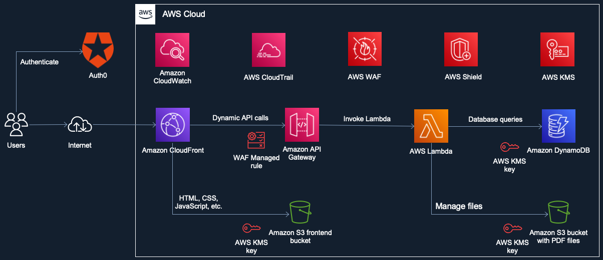

# Wholesale Widget Ordering Application

This project is a sample application that demonstrates AWS capabilities. It is a simple application that allows a user to order widgets from a wholesale supplier.

<https://d30bbnfu0x2i3e.cloudfront.net/>

## Architecture

The application is built using **React** and **AWS Amplify**. The identity provider is **Auth0**.

The application is deployed to AWS using AWS Amplify Console. The frontend is deployed to an S3 bucket behind Amazon CloudFront, and the backend is deployed to API Gateway endpoints.

When a user authenticates with Auth0, Auth0 issues identity and access tokens containing a custom claim describing the user's roles. The access token is used by the **Amazon API Gateway Lambda authorizers** to authorize API calls to the backend. The identity token is used by the frontend to customize the application's UI based on the user's roles.

**Amazon S3 pre-signed URLs** are used to securely upload widgets documentation to the target S3 bucket.

**Amazon CloudFront Signed Cookies** are used to restrict access to the documentation - only authorized users can access the files. Files are cached at CloudFront edge locations.

## Available Scripts

In the project directory, you can run:

### `npm start`

Runs the app in the development mode.\
Open [http://localhost:3000](http://localhost:3000) to view it in your browser.

The page will reload when you make changes.\
You may also see any lint errors in the console.

### `npm run build`

Builds the app for production to the `build` folder.\
It correctly bundles React in production mode and optimizes the build for the best performance.

The build is minified and the filenames include the hashes.\
Your app is ready to be deployed!
